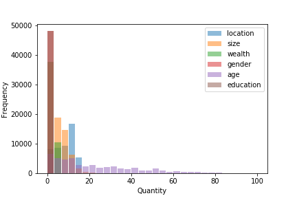
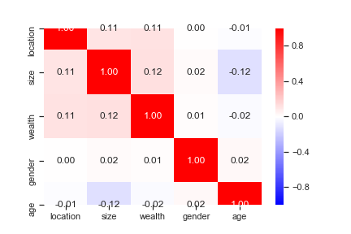
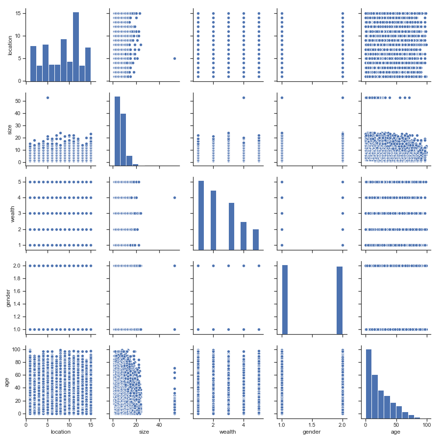
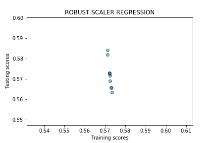
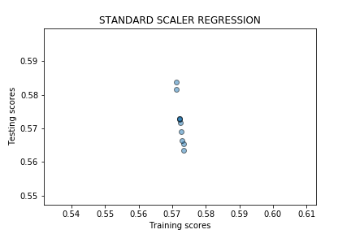
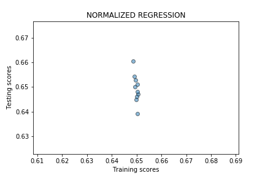
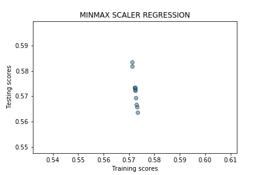

# Extra Credit Data 146

In general, this data describes different demographic features of Liberia, allowing one to see how these socioeconomic factors interrelate. Specifically, I analyzed how different regression techniques could be used to predict education status.  

## Data Overview

In addition to the target statistic of education, this data also includes information on location, size, wealth, gender, and age. The histogram below gives a general overview of these variables as well as their spread.

To begin the analysis, I looked into the relationships between each of these variables in order to ensure that there were no compounding relationships between the variables. In this data set, as seen in the heat map, there were no major linear correlations between any individual variables. In many ways this is positive, showing that each demographic feature is contributing its own piece of the puzzle and is not just another way of measuring the same features. The pair plot is also provided below and does give some hope that with scaling and the use of various regressions, a possible model could connect some of these covariates.

## Logistic Regression:

Scaler | Accuracy
--- | --- 
Raw| .57025 
Robust| .57020
Standard| .57030
Normalizer| .64652
MinMax| .57020

Overall, the logistic regressions that I tested did not produce models that I would be confident using to predict education status based on other demographic features. The normalized data produced the most accurate model with a R2 score of .64652; however, even this value is not high enough to be satisfied that this was the best model. Nevertheless, these results do demonstrate that applying different scalers can be a powerful tool; simply applying the normalizer scaler increased the accuracy by over 7%.

The plots above illustrate the spread of testing vs. training scores when doing a k-fold validation with each scaler. These plots suggest that other techniques, besides a logistic regression, should be used due to the fact that the training scores are largely concentrated while the testing scores cover a wider range.

## kNN:

Scaler | Neighbor Parameter | Accuracy
--- | --- | ---
Raw| 27 | .70225 
Robust| 19 | .70203
Standard| 30 | .70453
Normalizer| 26 | .66897
MinMax| 26 | .71146

In order to further investigate possible models, I ran a kNN regression with each of the different scalers on the data. As a result of this analysis, the best kNN model that I found was applying the MinMax scaler and assuming that each point had 26 closest neighbors. This regression yielded an average R2 score of .71146.

## Decision Tree:

Scaler | Min Split Parameter | Max Depth Parameter | Accuracy
--- | --- | --- | ---
Raw| 9 | 8 | .72019 
Robust| 9 | 8 | .72019 
Standard| 9 | 8 | .72015 
Normalizer| 6 | 10 | .6745 
MinMax| 9 | 8 | .72019 

In order to further investigate possible models, I ran decision tree regressions with each of the different scalers on the data. As a result of this analysis, the best decision tree models that I found were on the raw data, applying the normalizer scaler, or applying MinMax scaler and using the parameters of max_depth=9 and min_samples_split=8. These regressions all yielded an average R2 score of .72019.

## Random Forest:

Scaler | Min Split Parameter | Max Depth Parameter | Number of Trees | Accuracy
--- | --- | --- | --- | ---
Raw| 10 | 11 | 50 | .72561 
Robust| 10 | 11 | 50 | .72556
Standard| 10 | 11 | 50 | .72559 
Normalizer| 13 | 12 | 50 | .69697 
MinMax| 10 | 11 | 50 | .72559 

In order to further investigate possible models, I ran random forest regressions with each of the different scalers on the data as well as looking at forests with both 10 and 50 trees. As a result of this analysis, the best random forest model that I found was applying the standard scaler and using the parameters of max_depth=11, min_samples_split=10, and 50 trees. This regression yielded an average R2 score of .72559.

## Conclusion:

Overall, the most accurate model was the standard scaled data with a random forest regression with a R2 score of .72559. This accuracy would allow some prediction to be made of a location’s education level if given the other demographic features. However, in my opinion, this accuracy is not high enough to be confident in making any decisions based on the regression’s prediction. Therefore, before this model would ever be applied in a real-world context, more extensive testing should be done. This many include incorporating more variables, testing more regression techniques, or possibly including component analysis prior to regression.

